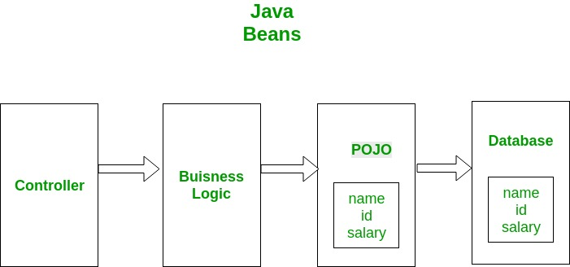

## POJO Class
POJO stands for **Plain Old Java Object**. It is an ordinary Java object, not bound by any special restriction other than those forced by the Java Language Specification and not requiring any classpath. POJOs are used for increasing the **readability** and **re-usability** of a program. POJOs have gained the most acceptance because they are easy to write and understand. They were introduced in EJB 3.0 by _Sun microsystems_.

POJO is an object which encapsulates Business Logic. Following image shows a working example of POJO class. Controllers interact with your business logic which in turn interact with POJO to access the database. In this example a database entity is represented by POJO. This POJO has the same members as database entity.



### POJO should not:

* Extend prespecified classes, Ex: `public class App extends javax.servlet.http.HttpServlet` { … } is not a POJO class.
* Implement prespecified interfaces, Ex: `public class App implements javax.ejb.EntityBean` { … } is not a POJO class.
* Contain prespecified annotations, Ex: `@javax.persistence.Entity public class App` { … } is not a POJO class.

**Common features of POJO & Bean:**

* Both classes must be public (i.e) accessible to all.
* Properties or variables defined in both classes must be private i.e. can't be accessed directly.
* Both classes must have default constructor i.e no argument constructor.
* Public Getter and Setter must be present in both the classes in order to access the variables/properties.

Example of POJO class:-
```java
public class Employee {
   public String emp_name;
   public String emp_id;
   private double emp_salary;
   public Employee(String name,String id,double salary) 
   {
      this.emp_name = name;
      this.emp_id = id;
      this.emp_salary = salary;
   }
   public String getName() {
      return emp_name;
   }
   public String getId() {
      return emp_id;
   }
   public Double getSalary() {
      return emp_salary;
   }
}
```
## JavaBean Class

A JavaBean is a reusable software component. A bean encapsulates many objects into one object so that we can access this object from multiple places. Moreover, it provides easy maintenance. It is a Java class and JavaBean are special types of pojos there are some restrictions on POJO to be a Bean:

* All JavaBeans are POJOs but not all POJOs are JavaBeans.
* Serializable i.e. they should implement Serializable interface. Still, some POJOs who don’t implement Serializable interface are called POJOs because Serializable is a marker interface and therefore not of much burden.
* Fields should be private. This is to provide the complete control on fields.
* Fields should have getters or setters or both.
* A no-arg constructor should be there in a bean.
* Fields are accessed only by constructor or getter setters.

The only difference between both the classes is Java make java beans objects serialized so that the state of a bean class could be preserved in case required. So due to this a Java Bean class must either `implements Serializable` or `Externalizable interface`.

Due to this it is stated that all JavaBeans are POJOs but not all POJOs are JavaBeans.

Example of JavaBean class:-
```java
package com.revature.com;
public class Student implements java.io.Serializable 
{
   private int stud_id;
   private String stud_name;
   public Student()
   {
   }
   public void setId(int id)
      {
         this.stud_id=id;
      }
   public int getId()
      {
         return stud_id;
      }
   public void setName(String name)
      {
         this.stud_name=name;
      }
   public String getName()
      {
         return stud_name;
      }
}

public class Students {
   	public static void main(String args[]){
	Student student = new Student();
	student.setId(101);
	student.setName("John");
	System.out.println("After setting the ID:" +student.getId());
	System.out.println("After setting the Name:" +student.getName());
   }
}
```
**Advantages of JavaBean**
* The JavaBean properties and methods can be exposed to another application.
* It provides an easiness to reuse the software components.

**Disadvantages of JavaBean**
* JavaBeans are mutable. So, it can't take advantages of immutable objects.
* Creating the setter and getter method for each property separately may lead to the boilerplate code.

<br>

**Difference between POJO and JavaBean**  

| POJO | JavaBean |
| ------ | ------ |
| It doesn’t have special restrictions other than those forced by Java language. | It is a special POJO which have some restrictions. |
| It doesn’t provide much control on members. | It provides complete control on members.| 
| It can implement Serializable interface. |	 It should implement serializable interface. |
|Fields can be accessed by their names. |	 Fields are accessed only by getters and setters. |
|Fields can have any visiblity. |	Fields have only private visiblity. |
| There may/may-not be a no-arg constructor. | It must have a no-arg constructor. |
|It is used when you don’t want to give restriction on your members and give user complete access of your entity.  | 	It is used when you want to provide user your entity but only some part of your entity.|

