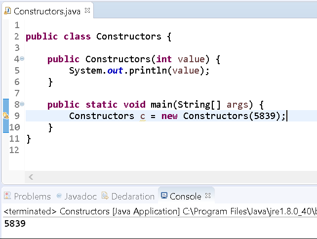
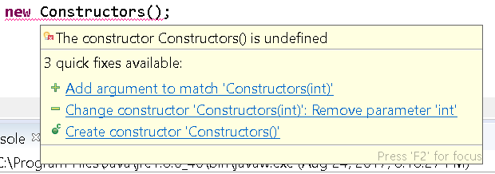
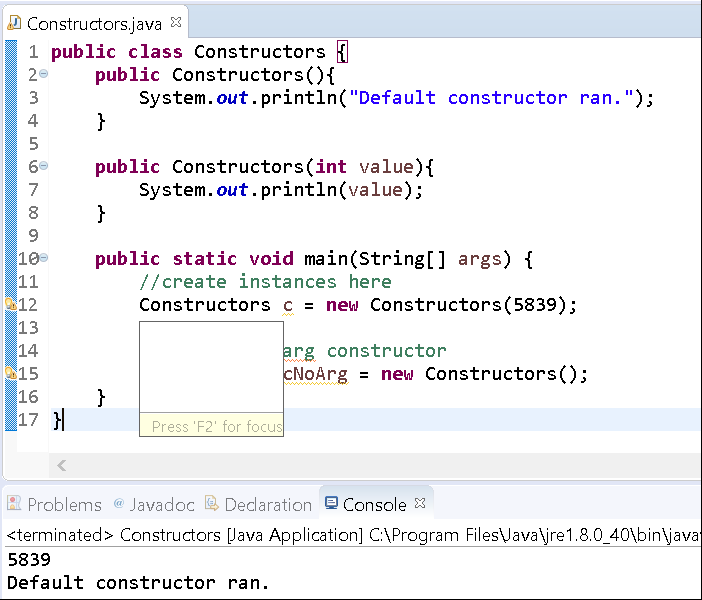

# Default Constructors

## Background

A **constructor** is a block of code that is executed when a class is instantiated. This block of code is executed _once_ per object that is created.

A **constructor** always have the same name as the class and can accept any number of parameters.

By default, if you create a class and don't specify a **constructor** the compiler will generate one for you. The one generated is called the default **no-arg constructor**.

For example, say you have the following class

```java
public class DefaultClass{

    public static void main(String[] args) {
        //create a new class instance
        DefaultClass dc = new DefaultClass();
    }
}
```

We have specified a constructor, so once compiled, the file will more resemble this structure:

```java
public class DefaultClass{

    public DefaultClass(){ }

    public static void main(String[] args) {
        //create a new class instance
        DefaultClass dc = new DefaultClass();
    }
}
```

## Instructions

Now that we have some background on constructors we'll walk through creating a class with different constructors.

### Project Setup

1.  Open your IDE (Eclipse), and select File > New > Java Project. 
2.  Provide the name, **Lab-Constructors** and click OK. 
3.  Right-click on the newly created project and select New > Class.
4.  Provide the class the name, **Constructors** and click OK.
5.  Now edit the file so that it looks like the following:

```java
public class Constructors {

    public static void main(String[] args) {
        //create instances here
    }
}
```
6. Now let's create a constructor that takes in an int.

```java
public class Constructors {

    public Constructors(int value){
        System.out.println(value);
    }

    public static void main(String[] args) {
        //create instances here
    }
}
```

7. In the `main` method instantiate a new Constructors object using the new constructor

```java
public class Constructors {

    public Constructors(int value){
        System.out.println(value);
    }

    public static void main(String[] args) {
        //create instances here
        Constructors c = new Constructors(5839);
    }
}
```

This new line creates a Constructors object passing it the value 5839 and assigns the object to the variable `c`.

Run the program.

You'll see that the constructor that we've specified executes its body.



Now edit the file to add a line to use the default no-arg constructor.

```java
public class Constructors {

    public Constructors(int value){
        System.out.println(value);
    }

    public static void main(String[] args) {
        //create instances here
        Constructors c = new Constructors(5839);

        //use the no-arg constructor
        Constructors cNoArg = new Constructors();
    }
}
```

The line that attempts to create a new Constructors object using the no-arg constructor is underlined in red. If you hover your mouse over the line, you'll see the message, _The constructor Constructors() is undefined_.



Typically the compiler creates a **no-arg constructor**, however, if you specify one (as we defined one with a single argument), then the compiler will _not_ add the default no-arg constructor.

Edit the file to specify a no-arg constructor:

```java
public class Constructors {

    public Constructors(){
        System.out.println("Default constructor ran.");
    }

    public Constructors(int value){
        System.out.println(value);
    }

    public static void main(String[] args) {
        //create instances here
        Constructors c = new Constructors(5839);

        //use the no-arg constructor
        Constructors cNoArg = new Constructors();
    }
}
```

Run the program.

You should observe the following output:

