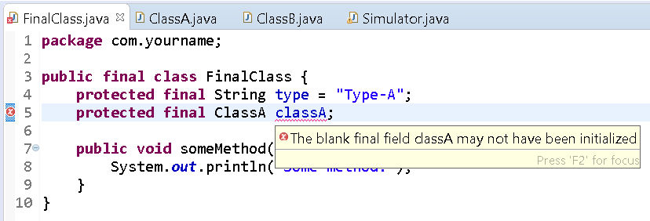
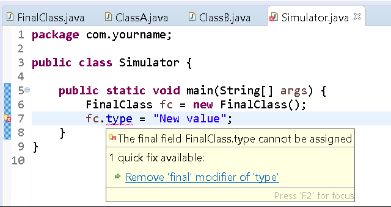
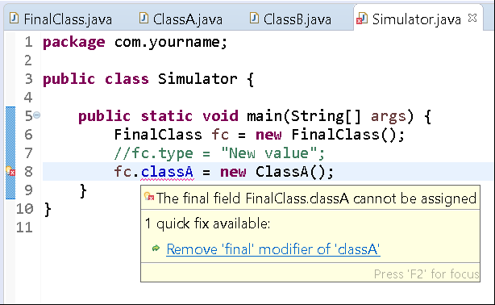
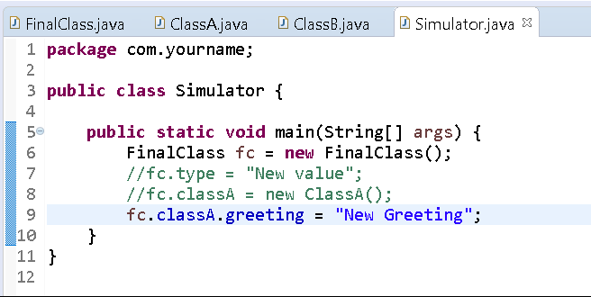
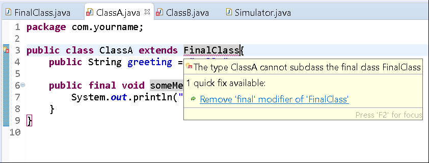
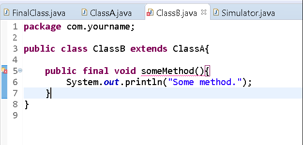
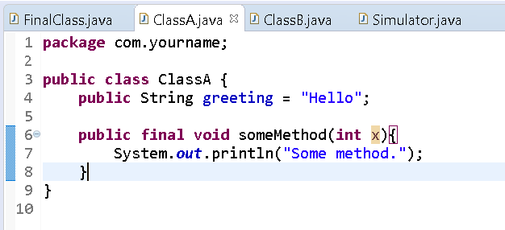

# final

## Background

The keyword `final` can be applied to a class, method or variable. In all cases it means the structure _cannot be changed_, but what that actually means depends upon the construct that it is applied to.

When applied to a variable, it means that you cannot reassign the variable to another value. You must initialize a final variable when declaring it.

```java
public final int x = 124;
```
When applied to a method, it means that you cannot _override_ the method.

```java
public final int someMethod(){ . . . }
```

When applied to a class, it means that you cannot create a subclass of this class.

```java
    public final class FinalClass { . . . }
```

A common example of a final class is the String class.

## Instructions

Below are instructions for you to follow to create an abstract class.

### Project Setup

1.  Open your IDE (Eclipse), and select File > New > Java Project. 
2.  Provide the name, **Lab-Final** and click OK. 
3.  Right-click on the newly created project and select New > Package.
4.  Provide the package name, **com.yourname** (replace "yourname" with your actual first name). Click Finish.
5.  Right-click on the newly created package and select New > Class.
6.  Provide the class the name, **FinalClass** and click OK.
7.  Now edit the file so that it looks like the following:

```java
package com.yourname;

public final class FinalClass {
    protected final String type = "Type-A";
    protected final ClassA classA;
    
    public final void someMethod(){
        System.out.println("Some method");
    }
}
```

8. Create another class in the same package named ClassA. Edit it to resemble the following:

```java
package com.yourname;

public class ClassA{
    public String greeting = "Hello";
    
    public final void someMethod(){
        System.out.println("Some method.");
    }
}
```

9. Create a child class of ClassA in the same package and name it ClassB. Edit it to resemble the following:

```java
public final class ClassB extends ClassA{

}
```

10. Create another class in the same package and name it Simulator.

Edit it to resemble the following:

```java
public class Simulator{
    public static void main(String[] args){
        FinalClass fc = new FinalClass();
    }
}
```

11. Excellent. The first thing to notice is that Eclipse catches our mistake in FinalClass. Although, we've declared the final reference variable `classA`, we did not initialize it.



Thus, the error, _The blank final field classA may not have been initialized_ message appears.

To fix this, we'll simply instantiate a new instance and assign it to the variable:

```java
package com.yourname;

public final class FinalClass {
    protected final String type = "Type-A";
    protected final ClassA classA = new ClassA();
    
    public final void someMethod(){ 
        System.out.println("Some method");
    }
}
```

Open the Simulator class and edit it to add a line to try and change the value of the variable `type`.

```java
public class Simulator{
    public static void main(String[] args){
        FinalClass fc = new FinalClass();
        fc.type = "New Value";
    }
}
```

Notice the error that occurs, because we're trying to change the value of a final field:



Comment that line.

Add a new statement below it to try create a new instance of ClassA and assign it to FinalClass's `classA` variable:

This too, causes a compiler error because we're trying to re-assign the value of a variable.



Comment the line out.

Now let's try to assign the greeting field value of the `classA` field on FinalClass.

Notice the difference:



This is valid code. Although, the classA field is marked **final**, the greeting property on it is not.

As a general rule, final reference variables cannot be reassigned to a different object _but_ their properties can still be reassigned (if not marked final).

Now, try to edit ClassA to make it **extend** FinalClass.

Notice the compiler error:



Remove that added code:

```java
package com.yourname;

public class ClassA{
    public String greeting = "Hello";
    
    public final void someMethod(){
        System.out.println("Some method.");
    }
}
```

Lastly, we know that we cannot override final methods in subclasses, but can we define another method that has the same name?

Open up ClassB and add the same exact method from ClassA into ClassB:

```java
public final class ClassB extends ClassA{
    public final void someMethod(){
        System.out.println("Some method.");
    }
}
```

Notice the compiler error displays:



Ok. That's as expected. Try changing the parameter list to include an `int` variable:

```java
public final class ClassB extends ClassA{
    public final void someMethod(int x){
        System.out.println("Some method.");
    }
}
```

Notice that no compiler errors appear and this code would execute without error:



This works, because we're not _overriding_ the method. We're _overloading_ it (since we changed the parameter list).