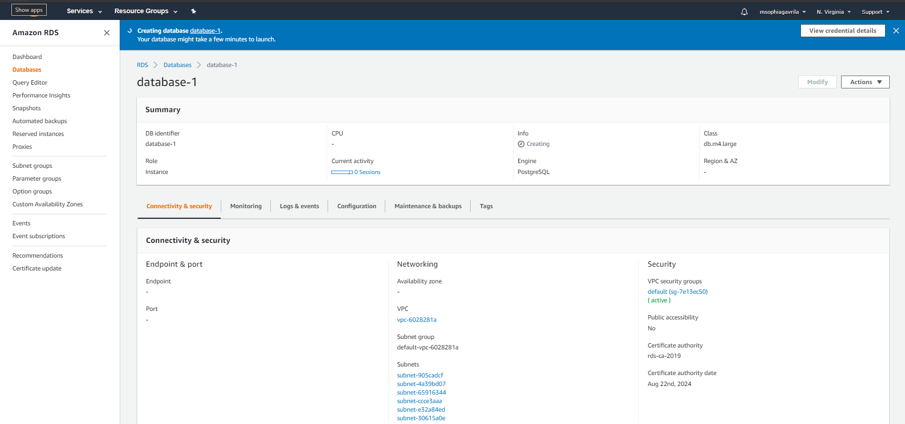
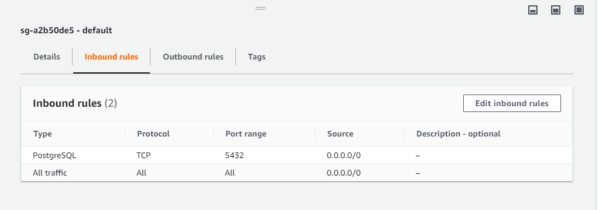
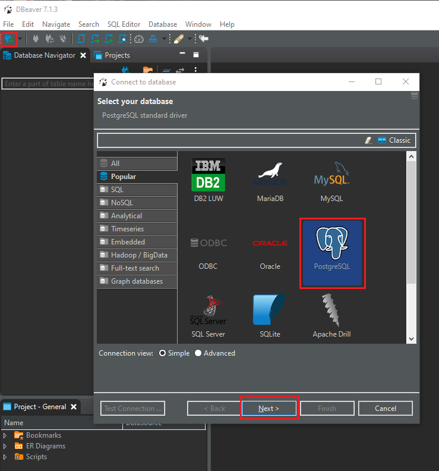
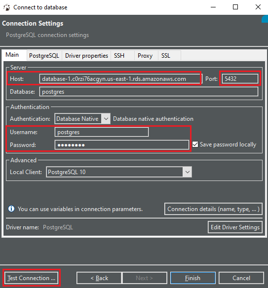

# Amazon Web Services
**AWS**  a subsidiary of Amazon that provides on-demand cloud computing platforms and APIs to individuals, companies, and governments, on a metered pay-as-you-go basis.  It is the most broadly adopted cloud platform, offering over 175 fully featured services from data centers globally.

In this example, we will cover a brief overview and demo to connect to **Amazon RDS**.

## Amazon RDS:
RDS is a Database as a Service (DBaaS) that automatically configures and maintains your databases in the AWS cloud. The user has limited power over specific configurations in comparison to running PostgreSQL directly on Elastic Compute Cloud (EC2). RDS is a convenient service, as long as the offered instances and configurations meet the user's needs.

### DB Instances:
The basic building block of Amazon RDS is the **DB instance**. A DB instance is an isolated database environment in the AWS Cloud. 

* Your DB instance can contain multiple user-created databases.
* You can access your DB instance by using the same tools and applications that you use with a standalone database instance.
* Create a DB instance using either the **AWS Management Console** or Command Line Interface.

Each DB instance runs on a **DB engine**. Amazon RDS currently supports the MySQL, MariaDB, **PostgreSQL**, Oracle, and Microsoft SQL Server DB engines.

## Amazon EC2
Amazon Elastic Compute Cloud is a part of Amazon.com's cloud-computing platform, Amazon Web Services, that allows users to rent virtual computers on which to run their own computer applications. 

* Using Amazon EC2 eliminates your need to invest in hardware up front, so you can develop and deploy applications faster. 
* You can use Amazon EC2 to launch as many or as few virtual servers as you need, configure security and networking, and manage storage.

## Demo: Configuring and Connecting to an Amazon RDS from DBeaver
Login to your [AWS account](https://aws.amazon.com/) first. If you haven't created an AWS account yet, go ahead and create one [here](https://portal.aws.amazon.com/billing/signup?nc2=h_ct&src=header_signup&redirect_url=https%3A%2F%2Faws.amazon.com%2Fregistration-confirmation#/start), and then follow the steps below:

1. Upon logging in, navigate to the *RDS Dashboard* by searching `RDS` and clicking the first result.

2. Select the following configurations:

    * `Create database`
    * `Standard create`
    * Engine Options: `PostgreSQL`
    * Version: `PostgreSQL 10.XX-R1` (the latest 10 version)
    * Templates: `Free tier`
    * DB Instance Identifier `accept default` (or provide your own)
    * Master username `postgres` (or provide your own)
    * Master password: `elephant` (or something easy to remember)
    * Public access: `Yes`

3. Click `Create database` at the bottom of the page.  If the creation is successful, you should see the following screen:

4. In a minute you should have finished creating your database.  Navigate to `Connectivity & security` and copy the `Endpoint` URL. It will look similar to `database-1.chfy3h5800ty.us-west-2.rds.amazonaws.com`

5. Before we're able to connect to the RDS,  we must make it accessible by modifying the default Security Group generated by AWS. To do so, click on the link under the `VPC security groups` subheading that looks something like `default (sg-7626fd0b)`. Note: this link also in the `Connectivity & security` section.

6. Click on `Inbound rules` then `Edit inbound rules` to navigate to the Edit inbound rules page.

7. Set Inbound rules to Type: `PostgreSQL`, and Source: `Anywhere`, then click `Save rules`

8. Open DBeaver and create a new connection to PostgreSQL and click `Next`.

9. Fill in the following configurations for your new connection, supplying the endpoint you copied from AWS and the username and password configured in AWS.  Instead of `localhost` your **Host:** will be the pasted endpoint from AWS.

10. Click `Test Connection` and if it's successful you should see a message that says `Connected` and will list the server it's running on along with the driver. Click `Finish`.

Congratulations! You have successfully connected to your Amazon RDS where any persisted data will be managed and stored on Amazon's cloud.

### References:
* [AWS RDS Documentation](https://docs.aws.amazon.com/AmazonRDS/latest/UserGuide/Welcome.html)
* [PostgreSQL on Amazon RDS](https://docs.aws.amazon.com/AmazonRDS/latest/UserGuide/CHAP_PostgreSQL.html)