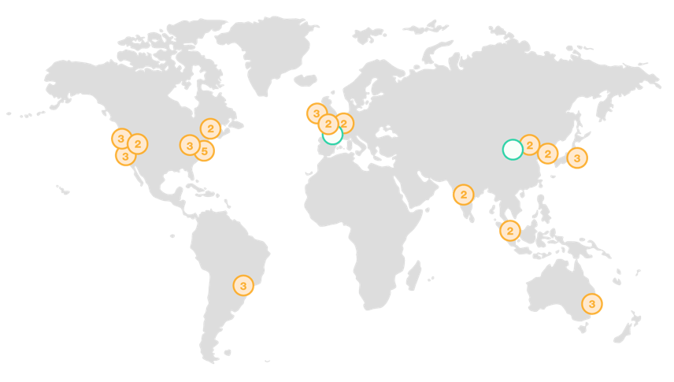
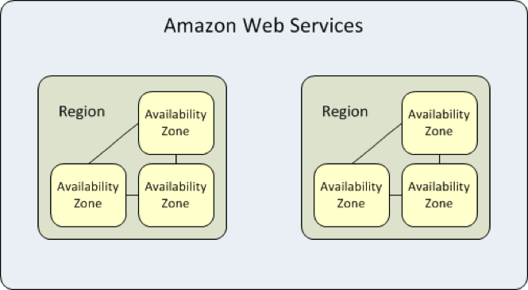

## AWS Regions & Availability Zones
AWS now spans **77 Availability Zones** within **24 geographic regions** around the world, and has announced plans for nine more Availability Zones and three more AWS Regions in Indonesia, Japan, and Spain.

### AWS Regions
An **AWS Region** is a geographical location with a collection of availability zones mapped to physical data centers in that region. Every region is physically isolated from and independent of every other region in terms of location, power, water supply, etc.

This level of isolation is critical for workloads with compliance and data sovereignty requirements where guarantees must be made that user data does not leave a particular geographic region. The presence of AWS regions worldwide is also important for workloads that are **latency-sensitive** and need to be located near users in a particular geographic area.

Inside each region, you will find two or more **availability zones** with each zone hosted in separate data centers from another zone.

### AWS Availability Zones
An availability zone is a logical data center in a region available for use by any AWS customer. Each zone in a region has redundant and separate power, networking and connectivity to reduce the likelihood of two zones failing simultaneously. 

