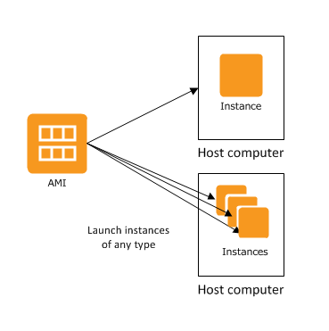

## Amazon Machine Image (AMI)
An Amazon Machine Image (AMI) provides the information required to launch an instance.  Think of it as a template for an EC2 Instance.

#### An AMI includes the following:
* One or more EBS snapshots.
* Launch permissions that control which AWS accounts can use the AMI to launch instances.
* A block device mapping that specifies the volumes to attach to the instance when it's launched.

### References
* [AMI Types](https://docs.aws.amazon.com/AWSEC2/latest/UserGuide/ComponentsAMIs.html)
