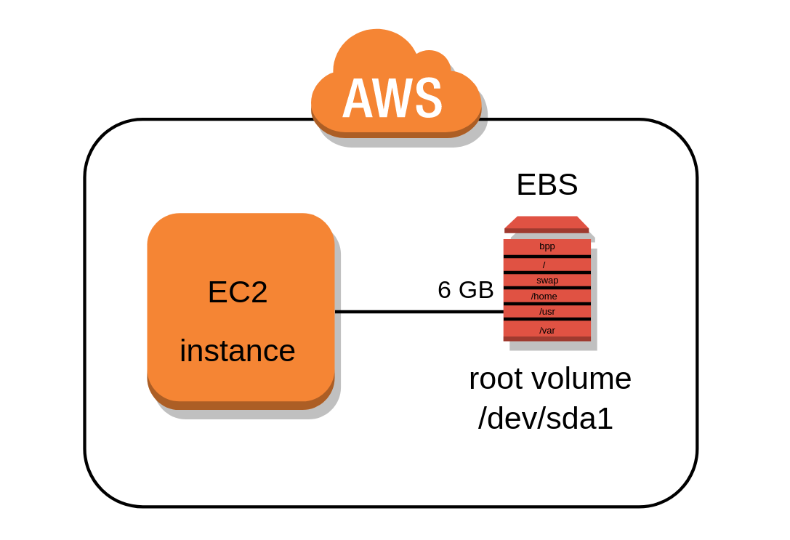

## Amazon Elastic Block Store (Amazon EBS)
Amazon Elastic Block Store (Amazon EBS) provides block level storage volumes for use with EC2 instances.

* EBS volumes behave like raw, unformatted block devices. You can mount these volumes as devices on your instances.
* EBS volumes that are attached to an instance are exposed as storage volumes that persist independently from the life of the instance. 
* You can create a file system on top of these volumes, or use them in any way you would use a block device (such as a hard drive). 
* You can dynamically change the configuration of a volume attached to an instance.
* With Amazon EBS, you pay only for what you use. 

### EBS Volumes
An Amazon EBS volume is a durable, block-level storage device that you can attach to your instances. After you attach a volume to an instance, you can use it as you would use a physical hard drive. You can use EBS volumes as primary storage for data that requires frequent updates, such as the system drive for an instance or storage for a database application.

* EBS volumes are created in a specific **Availability Zone**, and can then be attached to any instances in that same Availability Zone.

### EBS Snapshots
ou can back up the data on your Amazon EBS volumes to **Amazon S3** by taking point-in-time snapshots. Snapshots are incremental backups, which means that only the blocks on the device that have changed after your most recent snapshot are saved. 

### How to Create an EBS Volume for AWS EC2
1. Sign into AWS using your administrator account.
2. Navigate to the EC2 Console.
3. Choose a EC2 setup region from the Region drop-down list at the top of the page.
4. Select `Volumes` in the Navigation pane.
5. Click `Create Volume`.
6. Click `Create`.
7. Choose `Actions→ Create Snapshot`.
8. Type `EBS.Backup` in the Name field, type `Test Backup` in the Description field, and then click `Create`.
9. Click `Close`. The volume is ready to use.

When you finish this example, you can delete the volume you created by selecting its entry in the list and choosing Actions →Delete Volume. In a real-world setup, you can attach this volume to any EC2 instance or detach it when it’s no longer needed.

### References
* [AWS EBS Documentation](https://aws.amazon.com/ebs/?ebs-whats-new.sort-by=item.additionalFields.postDateTime&ebs-whats-new.sort-order=desc)
