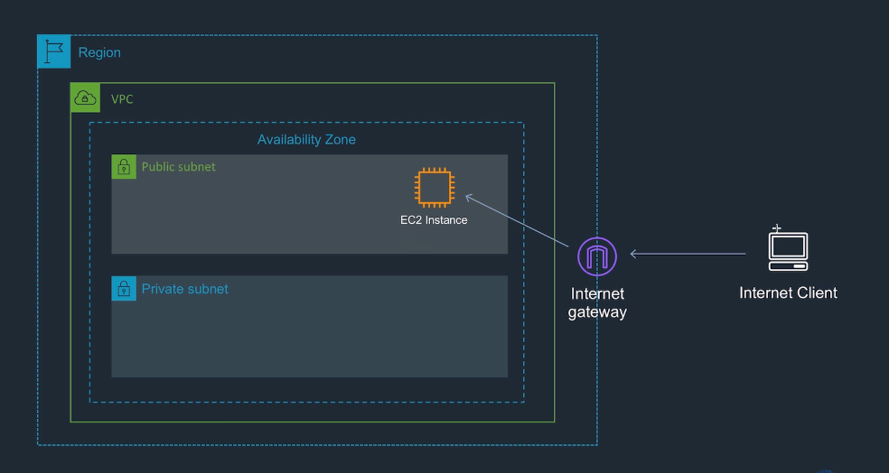
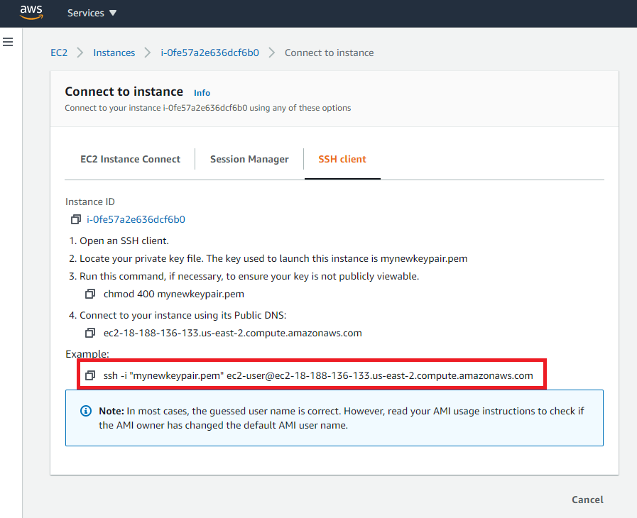

## How to SSH into an EC2
Your EC2 instance will be running in a public subnet.  Your EC2 instance has a public address on the internet which you are able to access from wherever you have internet access.

The relevant protocol by which we are able to access the instance is by using **Secure Shell (SSH)** which is the **TCP protocol port 22**.

1. On your AWS Management Console, go to EC2 > Instances > and click on the instance that you've just configured. Click `Connect` > `SSH Client`.
2. Open Command Prompt on Windows/Linux or Terminal on Mac.
3. Run the command given as `Example` under the connection instructions:

4. You may see the following message 
> `The authenticity of host 'ec2-18-188-136-133.us-east-2.compute.amazonaws.com (18.188.136.133)' can't be established.
ECDSA key fingerprint is SHA256:9Je3cWvvII8iQDuranju1h1lqJ+5+8cgThuDgzCzmns.
Are you sure you want to continue connecting (yes/no)?`

...run `yes`.

*You are now connected from your internet client to your EC2 instance!*

### References
* [AWS Guide to Connecting to EC2 Instance via SSH](https://docs.aws.amazon.com/AWSEC2/latest/UserGuide/AccessingInstancesLinux.html)
