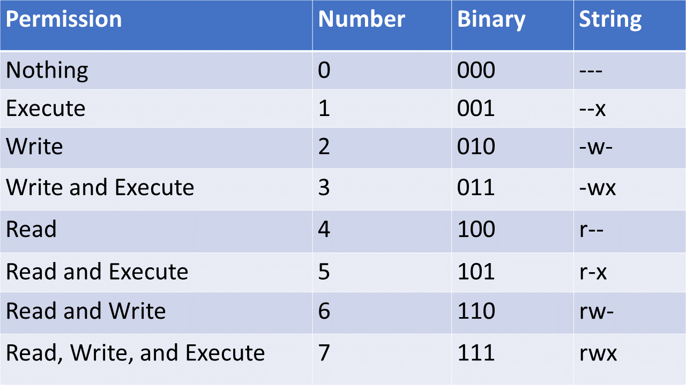

# File Permissions
In Unix, file permissions can become very important. Every file in Unix has three types of permissions.
1. Owner permissions - What the owner of the file is allowed to do to the file.
2. Group permissions - What the group of users that the file belongs to is allowed to do to the file.
3. Other (world) permissions - What everyone else is allowed to do to the file.

Each type of permission can have any combination of read (`r` or `4`), write (`w` or `2`), and execute (`x` or `1`) permissions. You can represent these permissions as either a number or a string of characters. For example, someone with read and write permissions has `6` or `rw` permissions.



## Viewing permissions

You can see the permissions of files in a directory by using the `-l` flag on the `ls` command to get it to print the "long listing format"

`ls -l .`

## Changing permissions

You can change the permissions on a file using the `chmod` or change file mode bits command.

If you are using the numbers, it is as simple as specifying the correct permissions for the `owner`, `groups`, and `other` types and issuing the command targeting the file. For example, if I wished the owner to have read, write, and execute, groups to have read and execute, and other to have read permissions on `hello.text` I would issue the following command:

`chmod 754 hello.txt`

Otherwise, if you are using the strings, you have to specify which groups you are granting or revoking access to. Owner (u), group (g), and other (o) can be specified or all (a) can be used. The `+` indicates a granted privilege, `-` indicates a revoked privilege, and `=` allows you to set privileges.

Examples:
```
# Everyone has all permissions
chmod a+rwx hello.txt
# Revoke write access to other
chmod o-w hello.txt
# Set group access to be the same as other
chmod g=o hello.txt
```