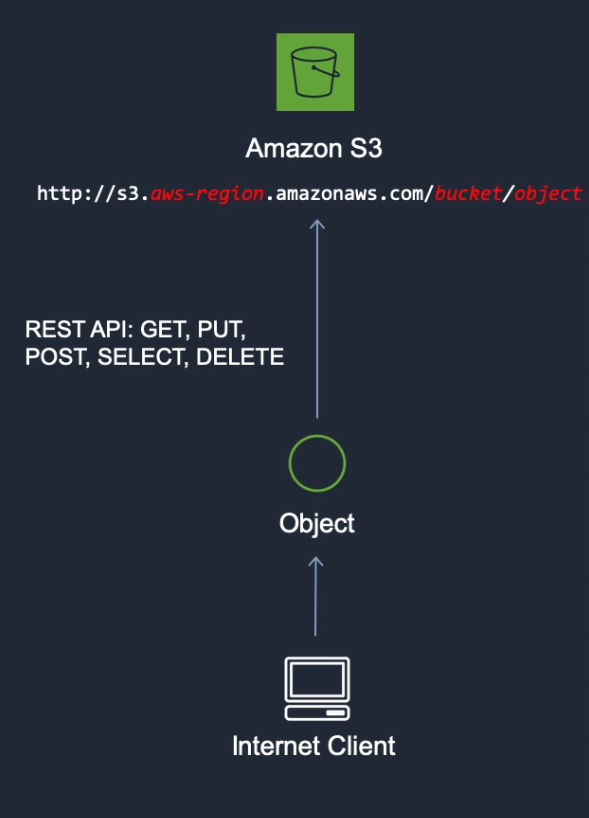
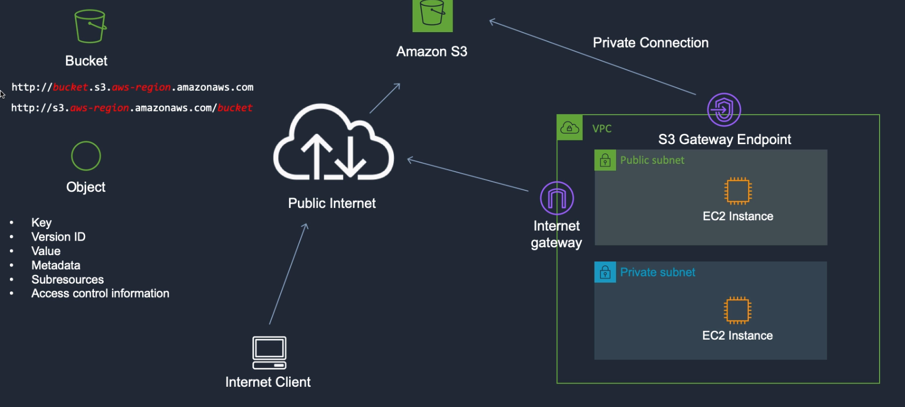

## Intro to Amazon Simple Storage Service (Amazon S3)
Amazon Simple Storage Service (Amazon S3) is an **object storage service** that offers industry-leading scalability, data availability, security, and performance. This means customers of all sizes and industries can use it to store and protect any amount of data for a range of use cases, such as data lakes, websites, mobile applications, backup and restore, archive, enterprise applications, IoT devices, and big data analytics. 

### S3 as an Object Storage System
Amazon S3 is an object storage system which means the data is stored as individual objects rather than in some kind of hierarchy like you would see in a file system or directory structure.

* Each individual object is put into a **bucket** and you connect to Amazon S3 using a URL.
* The URL will have the name of your object and the name of your bucket. The bucket is just the container in which you put your objects.
* You use what's called a REST API to connect to S3 using a URL.
* Your browser does a HTTP PUT request and it puts the objects in the bucket.

### Use Cases for S3
You can store any type of file in S3.

* Backup and Storage 
* Application Hosting
* Media Hosting
* Software Delivery - host software apps that your customers can download
* [Static Website Hosting](./static-site-hosting.md) - You can configure a static website to run from an S3 bucket.

### References
* [S3 Documentation](https://docs.aws.amazon.com/AmazonS3/latest/dev/Welcome.html)
