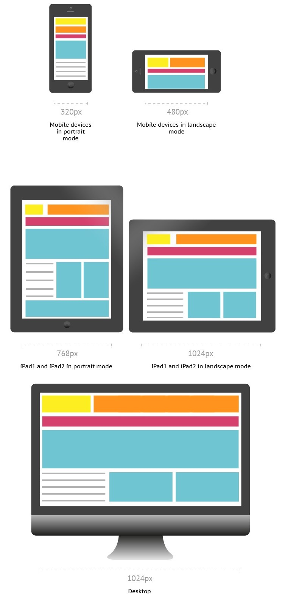

# Responsive Web design

Responsive Web design is the approach that allows websites and pages to render (or display) on all devices and screen sizes by automatically adapting to the screen, whether it’s a desktop, laptop, tablet, or smartphone. Responsive web design works through CSS, using various settings to serve different style properties depending on the screen size, orientation, resolution, color capability, and other characteristics of the user’s device. It is a combination of flexible grids, flex boxes, flexible images, and media queries.




#  CSS3  Media Queries

CSS3 supports responsive web design, all kinds of transitions, transformations, and animations and provides box-sizing tools that enable the user to adjust the size of any element without changing the dimensions or padding of the element.

Media queries allow you to customize the presentation of your web pages for a specific range of devices like mobile phones, tablets, desktops, etc. without any change in markups. It composed of a media type and expressions that check for the conditions of particular media features. It is a logical expression that is either true or false. 

**Syntax:**   A media query consists of an optional **media type** and any number of **media feature** expressions. Multiple queries are often combined in various ways by using **logical operators**. Media queries are case-insensitive. A media query is true if the media sort of the media query matches the media sort of the device and every one expression within the media query are true. It uses the `@media` rule to incorporate a block of CSS properties as long as a particular condition is true. Queries involving unknown media types are always false.

```
@media not|only mediatype and (mediafeature and|or|not mediafeature) {
  CSS-Code;
}
```
Media Types -  It describes the category of a device.
  * `all` - used for all media type devices 
  * `print`	- used for printers
  * `screen` - 	used primarily for screens like computer screens, tablets, smart-phones, etc.
  * `speech` - 	used for screenreaders that "reads" the page aloud

Media features - It describe specific characteristics of the user agent, output device, or environment. Some of the media features are `grid`, `height`, `width`, `hover`, `max-aspect-ratio`, `max-color`,`max-color-index`, `max-height`,etc.

Logical Operators  - It used to compose a media query . Logical Operators used in media queries are `not`, `and`, and `only`.
  
*Example:* It changes the background color of the `<body>` element to "red" and the font style to "Arial" when the browser window is 600px wide or less.
```
@media only screen and (max-width: 600px) {
  body {
    background-color: red;
    font-family: Arial;
  }
}
```

# Bootstrap

Bootstrap is an open-source framework and mobile-first approach for developing responsive websites. It is a front-end framework programmed to support both HTML5 and CSS3. It comprises the list of components such as Typography, Code, Table, Forms, Button, Images, Icons, etc. A responsive website is a website that automatically adjusts the screen size and looks good on all devices, from smartphones to a desktop. It is easy to use, saves time and customizable. Bootstrap 4 is the newest version of Bootstrap.

### How to Download Bootstrap?

There are two ways to download and start using Bootstrap for our website:
1. Download Bootstrap 4 - You can download the bootstrap from [getbootstrap.com](https://getbootstrap.com/).
2. Include Bootstrap  from a CDN - You can skip the download with [BootstrapCDN](https://www.bootstrapcdn.com/) by copying the links and paste it in the head section of the html code.

## Bootstrap grid systems

Bootstrap grid system consists of series of containers, rows, and columns to layout and align content. It creates a responsive layout and built with grid and flexboxes. 
Bootstrap classifies the screen sizes ranging from extra small to extra large based on the pixels. The transition between the various screen sizes is known as breakpoints. 
Bootstrap grid system provides a set of responsive classes to specify the screen size. 

### Bootstrap containers

Containers are the basic layout elements used to wrap the content in the website. The container is the root of the Bootstrap 4 grid system which consists of all the elements and controls the layout width of a page. 

Bootstrap provides two container classes:
* `.container` - used to provide the responsive fixed width container
* `.container-fluid`  - used to provides a full-width container that spans the entire width of the viewport.

```
<div class="container">
  Hello! I am in a Fixed container.
</div>

<div class="container-fluid">
  Hello! I am in a Fluid container.
</div>
```
### Bootstrap rows

Bootstrap rows are horizontal slices of the screen. They are only used for containing columns or a wrapper for columns. They have to be placed in containers to avoid the horizontal scroll on the page. The bootstrap columns should be children for the row, to align properly. `.row` class is used to create the rows inside the container.
```
<div class="row">
  ...
</div>
```

### Bootstrap columns

`.col `class sets the width for the column dynamically that means we can set the width of each column in a row. Grid system supports a maximum of 12 columns in a row and anything after that will be shifted to a next row. 

You can set the `size` for the column (ranging from 1 to 12). *For example:* The .col-4 class creates 3 equal columns (because 12/4= 3 columns). The col-6 class creates 2 equal columns. We can also set different sizes for them. 
```
<div class="row">
  <div class="col-5">
    This is col-5
  </div>
  <div class="col-7">
    This is col-7    
  </div>
</div>
```

Also, You can set the *Breakpoints* for columns and used to specify the screen resolution. `.col-[breakpoint]` class is used to deine the behaviour for the columns in the displayed devices. There are 4 different breakpoint class listed below:
* `.col-sm` - used for small devices where the screen width is equal to or greater than 576px
* `.col-md` - used for medium devices where the screen width equal to or greater than 768px
* `.col-lg`- used for large devices where the screen width equal to or greater than 992px
* `.col-xl` - used for extra-large devices where the screen width equal to or greater than 1200px

```
<div class="row">
 <div class="col-lg">
   This is a column
 </div>
</div>
```

We can combine the sizes and breakpoints and use a single class with the format `.col-[breakpoint]-[size]`. Below we have a simple example for Bootstrap Grid System.

```
<!-- Using ootstrap container class -->
<html> 
<head> 
  <title>Bootstrap Grid System </title> 
    
  <!-- Add Bootstrap Links -->
  <link rel="stylesheet" href="https://maxcdn.bootstrapcdn.com/bootstrap/3.3.7/css/bootstrap.min.css"> 
  <script src="https://ajax.googleapis.com/ajax/libs/jquery/3.3.1/jquery.min.js"></script> 
  <script src="https://maxcdn.bootstrapcdn.com/bootstrap/3.3.7/js/bootstrap.min.js"></script> 
</head> 
  
<body> 
    <div class="container" >
      <div class="row" >
            <div class="col-4 border" >
              This is a col-lg-4
            </div>
            <div class="col-3 border">
              This is a col-lg-3
            </div>
        </div>
        <div class="row">
            <div class="col-sm-6 border">
              This is a col-lg-6
            </div>
            <div class="col-sm-6 border">
              This is a col-lg-6
            </div>
        </div>
    </div>
</body>
</html>
```

## Bootstrap Tables

The bootstrap provides classes to style of HTML tables. To change the default style of HTML table, add bootstrap `.table` class to the `<table>` element. Bootstrap table classes used to create striped table rouws, add borders to the cell and the tables, add the colors to the table rows, table headers and also allow us to differentiate handover rows, etc. 

```
<div class="container">
 <table class="table ">
    ...
 </table>
</div>
```
The following classes are used with `.table` class like `<table class="table [class-name]">` to add styles to the table:
* `.table-dark `- used to get a dark background table with the light text.
* `.table-bordered` - adds the border on all sides of the table and cells.
* `.table-striped` - used to add zebra-stripes table rows.
* `.table-hover` - applies the hover effect to the table rows and cells, i.e, you will get grey background when a cursor rolls over a cell or a row.
* `.thead-light `- used within `<thead>`, it makes the table header to appear light.
* `.thead- dark` - used within `<thead>`,  it makes the table header to appear dark gray.

*Contextual classes* is used to color the table rows `<tr>` and cells `<td>` individually. We can used these contextual classes in `<tr>` and `<tr>` of the `<table>` element: `.table-warning`, `.table-primary`, `.table-info`, `.table-success`, `.table-danger`, `.table-active`, `.table-light`, `.table-secondary` and `.table-dark`. (for example: `<tr class="table-primary">`).

## Bootstrap Alerts

Bootstrap alerts provide the contextual feedback messages for user actions on the page.  Alert boxes contain text that needs the user's attention. The `.alert` class is display the alert message on website. 
The `.alert` class is used as base class then followed by contextual classes . The contextual alert classes are: `.alert-success`, `.alert-info`, `.alert-warning`, `.alert-danger`, `.alert-primary`, `.alert-secondary`, `.alert-light` and `.alert-dark`. 
 Also, we can dismiss/close any alert messages by using `.alert-dismissible` class. We can animate alerts when dismissing  by using `.fade` and `.show` classes. Just add the `data-dismiss="alert"` attribute  and  `class = "close"` attribute to the `<button>` element to close the alert message boxes. 

In the below example, we are creating a success alert message box by adding the contextual class .alert-success to the .alert base class.
```
<div class="alert alert-success alert-dismissible fade show"> <strong>Success!</strong> 
Your details submitted successfully. 
<button type="button" class="close" data-dismiss="alert">&times;</button> 
</div>
```

## Bootstrap forms

Bootstrap forms allow us to create elegant forms on the website. We can style the all textual form controls like input, select, textarea, etc., by using `.form-control class`. There are 3 different types of form layout - Vertical Form layout, Horizontal Form layout, Inline Form layout.

Vertical Form Layout - This is a default default form layout provided by Bootstrap. 

Horizontal Form Layout - In this layout, labels and form controls are aligned side-by-side by using the Bootstrap grid classes. The  `.row`  class and the `.col-*-* `grid classes used on the form groups to define the width of the layout. Also, to center them vertically we use `.col-form-label` on the `<label>`elements. 

Inline Form layout - In this layout, a series of labels, form controls, and buttons are displayed in a single horizontal row. The `.form-inline`  class is used within ` &lt;form&gt;` element to create inline form layout.

We can stack the checkboxes or radio buttons vertically (line by line) , by appling the class `.d-block` on each `<label>` element.  

Below, we have a simple example for Horizontal Form Layout.
```
  <div class="form-group row">
        <label for="inputEmail" class="col-sm-2 col-form-label">Email</label>
        <div class="col-sm-10">
            <input type="email" class="form-control" id="inputEmail" placeholder="Email">
        </div>
  </div>
```
## Bootstrap buttons

Bootstrap includes several button styles in which each styles serves a semantic purpose.The `.btn `classes are designed to be used with the `<button>`, `<a>` and `<input>` element. 
The contextual classes used with the `.btn` classes are `btn-primary`, `btn-secondary`, `btn-success`, `btn-danger`, `btn-warning`, `btn-info`, `btn-dark`, `btn-light`, and `btn-link`. 
When using button classes on `<a>` elements, we should use `role="button"` attribute to convey the purpose.The `.btn-outline-*` used to remove all background colors on any button. The `.btn-lg` or`.btn-sm` classes are used to create larger and smaller buttons. The `.active` and `.disabled` class are used to represent the active and disabled state programmatically.

Example:
```
<button type="button" class="btn btn-primary btn-lg">Large button</button>
<button type="button" class="btn btn-outline-secondary btn-lg">Large button</button>
```

## Bootstrap Navbar

Bootstrap allows us to create a responsive navigation header that includes support for navigation, branding, collapse plugin and more. Navbars require a wrapping `.navbar` with `.navbar-expand{-sm|-md|-lg|-xl}` for responsive collapsing and color scheme classes. Some of the navbars sub-components are listed below with their purposes.  
* `.navbar-brand`  - used with most elements that contain the name of the company, product, or project.
* `navbar-toggler`  -  used for collapse plugin and other navigation toggling behaviors (allows to change the position on mobile devices)
* `.form-inline` - used with any form-controls and actions.
* `.navbar-text`  - used to align the text vertically also makes it centered.
* `.collapse.navbar-collapse` - used for grouping and hiding navbar contents depending upon the screen resolution.


## Bootstrap Colors
Bootstrap provides color utility classes that support for styling links with hover states.

Text color - used to set the color for text of an element. The contextual text color classes are `.text-muted`, `.text-primary`, `.text-success`, `.text-info`, `.text-warning`, `.text-danger`, `.text-secondary`, `.text-white`, `.text-dark`, `.text-body`, and `.text-light`.

Background color - used to set the background color for an element. The contextual background color classes are similar to the contextual text color classes, here we use `.bg-*` instead of `text-*`.

Example:
```
<!-- setting text color-->
<p class="text-success">.text-success</p>
<p class="text-danger">.text-danger</p>
<p class="text-warning">.text-warning</p>

<!--setting background and text color-->
<div class="bg-light text-dark">.bg-light</div>
<div class="bg-dark text-white">.bg-dark</div>
<div class="bg-white text-dark">.bg-white</div>
<div class="bg-transparent text-dark">.bg-transparent</div>
```
