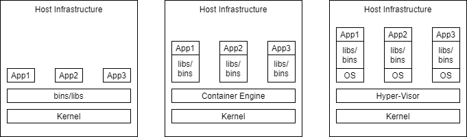

# Containers vs. Virtual Machines 
## References 
- [Containers explained in relation to VMs from F5 Dev Central](https://www.youtube.com/watch?v=wuhxSLapDe0)
- Docker for the Virtualization Admin Book- [View here](https://goto.docker.com/rs/929-FJL-178/images/docker-for-the-virtualization-admin.pdf)
- [IBM on VMs vs. Containers](https://www.ibm.com/cloud/learn/containerization#toc-virtualiza-jttBZ0x-)
- [IBM on Virtualization](https://www.ibm.com/cloud/learn/virtualization-a-complete-guide)

## Overview 

Virtual machines and containers provide the ability to isolate processes from one another and provide some kind of virtualization, so that the processes can run in their own sandbox environment on the same host machine. However, virtual machines and containers do so in differing ways. 

**Note**, *virtualization* means to provide a virtualized view of some set of resources. For example, a process may have a virtualized view of a file system where it believes that it is manipulating the root of the system. Meanwhile, the directory that the process manipulates is many layers away from the root. 

## Virtual Machines
Virtual Machines simulate a physical server so that multiple "servers" can run on a single machine. 

They virtualize the entire supporting OS. Thus, using virtual machines your host computer could be windows based and you could still run a Linux OS and an application on top of it. 

Virtual machines are enabled by *hypervisors*, software that coordinates between multiple vms and interfaces with the underlying infrastructure. (Some hypervisors interact directly with the hardware, while others run on top of the underlying OS.)

### Pros
- near total isolation
- Provides virtualization
    -  virtualizing the entire OS
- Ensures an application runs reliably regardless of Host

### Cons
- considered "bulky", expensive in the context of resources 

## Containers
Containers bundle together applications with their supporting libraries and dependencies, allowing them to run isolated from one another. However, containers still share the underlying OS kernel and are, therefore, much lighter weight than virtual machines. 

Containers provide their processes a virtualized view of the underlying resources. Processes within a container only see a particular version of their environment and have limited access to resources- isolating them from the rest of the processes running on a given host. 

Containerization is enabled by an engine running on the host i.e. the Docker Engine. 

### Pros
- considered "light weight", because they don't require spinning up a whole guest OS
- they can enable layers of isolation or partial isolation-- depending on how they are implemented 
- provide a virtualized view of certain resources.
- Package an application in an isolated environment
- Ensure an application runs reliably regardless of Host

### Cons
- having layers of isolation
    - if you have need of very strict and complete isolation the ability to have layers can be a con

## Summary 
In most cases containers are preferable to virtual machines since they provide isolation and virtualization without the cost of having to spin up an entire OS on top of the host. They also enable you to vary the layers of isolation, occasionally sharing necessary resources between processes in differing containers. 

However, when a developer desires near total isolation then they may prefer to run their set of processes/application in a virtual machine. 

