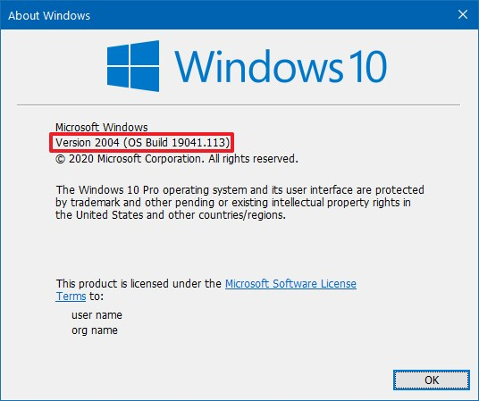

# Installing Docker
## References
- [Docker Installation for Windows Home](https://docs.docker.com/docker-for-windows/install-windows-home/)
- [Docker Installation for Mac](https://docs.docker.com/docker-for-mac/install/)

## Background
Docker has a number of components that work in tandem to bring you a standardized way of working with containerization technology. 

**Docker Engine**: 
- Docker Deamon
- APIs that allow for interaction with the deamon -- importantly the CLI(Command Line Interface)

**Docker Desktop** is the manner through which you install the *Docker Engine* on Windows and Mac OS -- it includes: 
- the Docker Engine
- Kubernetes
- Docker Compose
- Notary
- Credential Helper 

Determine the OS and continue with the installation steps for that environment:
- Windows: 
	- Type Windows Key + R
	- Then run the command `winver`
	- Make a note of Home or Pro OS as well as the version and build. 
	- If you are on Windows 10 Home version 2004 build 19041 or later, then see [Docker Installation for Windows Home.](#docker-installation-for-windows-home)




- Mac:  
	- [Instructions for checking the OS version are here.](https://support.apple.com/en-us/HT201260#:~:text=From%20the%20Apple%20menu%20%EF%A3%BF,version%20number%20to%20see%20it.)
	- If you are using hardware from 2010 or later and version 15.13 or later (Catalina, Mojave, or High Sierra) see [Docker Installation for Mac.](#docker-installation-for-mac)


```
COMMENTS
- should focus on installation on Windows10 20H1 with WSL2
- should focus on installation on macOS 10.15 Catalina
- add the basic setup for each environment using either command line or user interface
```

# Installation

### [Docker Installation for Windows Home](https://docs.docker.com/docker-for-windows/install-windows-home/)

First, let's check our system requirements. 

Go to `This PC > Properties`. 

You should have more than 4GB of RAM and you should have a 64 bit processor.  (In System Type it should begin 64-bit...) 

Second, we must make sure BIOS-level hardware virtualization is enabled.

In order to check for this go to the task manager and click over to the performance tab. You should see the section *Virtualization* and it should say *enabled*. 


If the task manager page says that virtualization is *disabled*, then go to your BIOS menu to enable virtualization. This will look slightly different depending on your hardware, but you can access the BIOS menu through the instructions in this [link.](https://support.bluestacks.com/hc/en-us/articles/115003174386-How-can-I-enable-virtualization-VT-on-my-PC-#%E2%80%9C3%E2%80%9D) 

If you have a hard time finding out how to enable virtualization from the BIOS menu, then you may need to do a google search of your manufacturer and the phrase "enable virtualization" to locate additional hardware specific instructions. 

Note: Docker Desktop allows Windows users to use either Windows Containers (on a Windows OS) or via Hyper-V and virtualization creating Linux containers via a Windows Subsystem for Linux. 

Now you'll need to enable WSL 2. (The second version of Windows Subsystem for Linux.) (Remember your build has to be later than 19041.)

Open PowerShell as an admin. 


Then run the command. 
```PowerShell
dism.exe /online /enable-feature /featurename:Microsoft-Windows-Subsystem-Linux /all /norestart
```
Then run. 
```PowerShell
dism.exe /online /enable-feature /featurename:VirtualMachinePlatform /all /norestart
```
Finally restart your computer. 

Finally you should be all set to download the installer for Docker from [here.](https://hub.docker.com/editions/community/docker-ce-desktop-windows/)

You will want the *stable* version. 

Once the download completes, double click on the installer (the .exe file you just downloaded.) This will begin running the installer. 

Select Enable WSL 2 Features when prompted. 

Then follow the defaults and eventually select close to complete the installation process.

Now you must start up Docker Desktop. Go to Docker Desktop and select run. 


Once the icon in the status bar is no longer changing, then you are ready to use docker. (It will look like the following image.)


The tutorial should automatically launch. 

Additionally you can test docker out by opening up a command prompt and running the following command. 
```console
docker run hello-world
```
You should see something like
```console
Unable to find image 'hello-world:latest' locally
latest: Pulling from library/hello-world
0e03bdcc26d7: Pull complete                                                                                             Digest: sha256:d58e752213a51785838f9eed2b7a498ffa1cb3aa7f946dda11af39286c3db9a9
Status: Downloaded newer image for hello-world:latest

Hello from Docker!
This message shows that your installation appears to be working correctly.

To generate this message, Docker took the following steps:
 1. The Docker client contacted the Docker daemon.
 2. The Docker daemon pulled the "hello-world" image from the Docker Hub.
    (amd64)
 3. The Docker daemon created a new container from that image which runs the
    executable that produces the output you are currently reading.
 4. The Docker daemon streamed that output to the Docker client, which sent it
    to your terminal.

To try something more ambitious, you can run an Ubuntu container with:
 $ docker run -it ubuntu bash

Share images, automate workflows, and more with a free Docker ID:
 https://hub.docker.com/

For more examples and ideas, visit:
 https://docs.docker.com/get-started/

```
### [Docker Installation for Mac](https://docs.docker.com/docker-for-mac/install/)

**Note:** You must be working with a Mac newer than 2010 and your operating system must be one of the most recent three versions.

Go to [Docker Hub.](https://hub.docker.com/editions/community/docker-ce-desktop-mac/) And download the *stable* version. 

Then double click on the `Docker.dmg` file you just downloaded to open the installer. 

Drag and drop Docker into the applications folder. 


Then, on the `Docker.app` in the Apps folder, double click. 


You should see the little whale icon popup in the status bar and the on-boarding tutorial should begin. 


Additionally, to test docker instead of or in addition to you can open up Terminal and run the following command. 

```console
docker run hello-world
```
You should see something like
```console
Unable to find image 'hello-world:latest' locally
latest: Pulling from library/hello-world
0e03bdcc26d7: Pull complete                                                                                             Digest: sha256:d58e752213a51785838f9eed2b7a498ffa1cb3aa7f946dda11af39286c3db9a9
Status: Downloaded newer image for hello-world:latest

Hello from Docker!
This message shows that your installation appears to be working correctly.

To generate this message, Docker took the following steps:
 1. The Docker client contacted the Docker daemon.
 2. The Docker daemon pulled the "hello-world" image from the Docker Hub.
    (amd64)
 3. The Docker daemon created a new container from that image which runs the
    executable that produces the output you are currently reading.
 4. The Docker daemon streamed that output to the Docker client, which sent it
    to your terminal.

To try something more ambitious, you can run an Ubuntu container with:
 $ docker run -it ubuntu bash

Share images, automate workflows, and more with a free Docker ID:
 https://hub.docker.com/

For more examples and ideas, visit:
 https://docs.docker.com/get-started/

```

## Alternate instructions

### [Docker Installation for WindowsPro](https://docs.docker.com/docker-for-windows/install)

Paid upgraded version of Windows.  

### [Docker Installation for Linux](https://docs.docker.com/engine/install/)

### [Older Mac and Windows Machines](https://docs.docker.com/toolbox/toolbox_install_windows/)