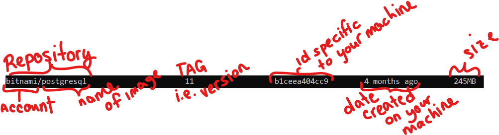
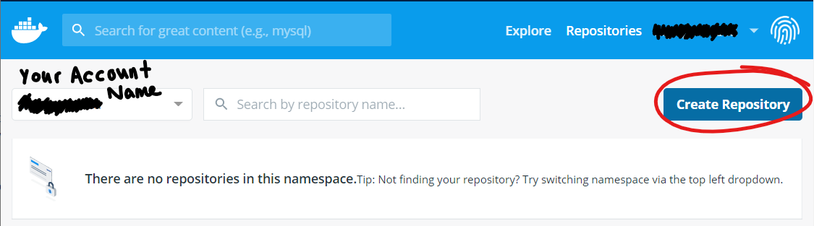
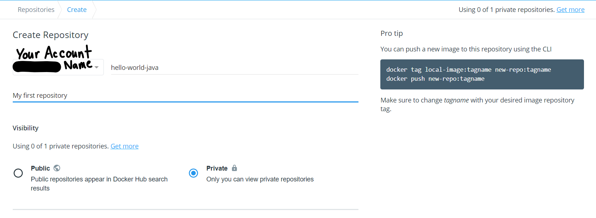
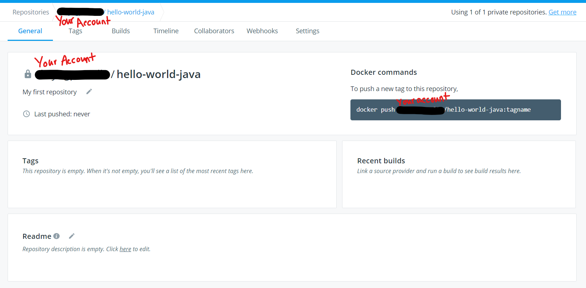

# Dockerhub

## References
- [DockerHub Getting Started- both a reference and good extra reading](https://docs.docker.com/docker-hub/)
- [Docker Registries in Docker Architecture](https://docs.docker.com/get-started/overview/#docker-registries)
- [Docker Repositories](https://docs.docker.com/docker-hub/repos/)

## Overview 
DockerHub is an official docker registry that allows developers to publish and share their images easily.

Recall that an image is the base from which a container can be created, and thus a containerized application can be run. So, to publish an image essentially allows a developer to publish a ready made application. 

In this case, registry really just means image storage space, and the DockerHub is just the centralized image storage space supported by Docker. 

The Docker Engine is by default configured to  *push* and *pull* images to/from the DockerHub. In other words, when you go to share your image or when you go to use an image that is not already available on your local machine, docker may add to/get from the available images on the DockerHub respectively (unless you have configured your engine to work with a different image registry).

Typically an organization will have an account in the DockerHub and then for any container images they publish they will have a particular DockerHub repository for a particular project. 

As you seek to use these ready made images be careful to try to stick to official images or images from known developers. 

**Note** a Docker repository typically corresponds to a particular docker image. Though multiple versions may have been pushed to a particular repository under different tag names.  

So if we take a look at a typical image name as it would display on your machine- we can see this breakdown. 



The section entitled repository is typically an account/repository-name. 

While you need an account to push to a particular repository on the DockerHub, you by default have access to all the publicly available images on the DockerHub. 

Now let's talk about making your own images readily available. 

### Create an account
The DockerHub allows you to create an account. This not only enables you to have a publicly available repository but also a private repository as well. 

To create an account you can simply go to [Dockerhub](https://hub.docker.com/) and sign up. 

Then you will want to go to the same link and sign in. Once you are into your account online, you can create a repository and make it private.

### Create a repository 

1. Click on the upper right and click on "Repositories". It should bring you to a view like this where you will choose create repository: 


2. Then name your repository and select private. 


3. This should bring you to:


Wonderful! Now that you're all set up, we'll walk through creating an image and pushing it to this new repository. (Make a note of the your repo name and account name. In this case the repo name is *hello-world-java* and the account has a dark line through it.)

### Create an image

While we walk through the steps to creating an image here- they are better explained in the notes on [buiilding an image](./building-an-image.md) and in the [dockerfile notes](./dockerfile-keywords.md). 

Now let's take the following file and save it to a new otherwise empty folder as *dockerfile* (without an extension). For example, perhaps you create a folder *docker-examples* in *Documents*.   
```dockerfile
# Define the parent image
FROM ubuntu

# Install needed programs
RUN apt-get update
RUN apt-get -y dist-upgrade
RUN apt-get -y install default-jdk 

# Within the image and thus container, set the working directory to the new directory example
WORKDIR /example

# Create Hello World Java program and save it in the appropriate file 
RUN echo 'public class HiWorld{ public static void main(String[] args){System.out.println("Hi world");}}'> HiWorld.java

# Compile the Java program, creating the file that the JVM can actually run 
RUN javac HiWorld.java

# Run the HelloWorld program in the container 
CMD ["java", "HiWorld"]
```
Now open your commandline and cd (change directory) into the folder where you saved your dockerfile. 

If it was the same as the example your cd command might look like this: 
```
cd Documents
cd docker-examples
```
And from there run the command 
```
docker build -t account-name/hello-world-java:1.0 .
``` 
*Account-name* should be your actual account-name. Don't forget the period at the end. 

The -t flag allows us to name our image and in this case we are naming our image with our account name / our repo name : a tag that indicates version 1. 

### Push image

Now we can login to our account by following the prompts after running the command: 
```
docker login
```
Finally we can push- sending our image up to our remote repository: 
```
docker push account-name/hello-world-java:1.0 
```
*Replace account-name with your account-name*. 

You should be able to see the newly pushed image in your account now! 

**Note** we conveniently named our image in a way compatible to our account. If we instead had a local name that was different from our account and repository then we could have run the following command to push the image: (We can omit the account-name if we are logged in.)
```
docker tag local-image:tagname repo-name:tagname
docker push repo-name:tagname
```
And that sums up the key takeaways for pushing an image. 

### Get images from DockerHub
`docker search image-name` 
  - if you are unsure of what image you want to pull you can search the DockerHub using the `docker search` command
  - this command will result in a list of available images with the name you searched
  - For example, there are many versions creators of a Java image, so we could try searching
  ```
  docker search java
  ```

`docker pull image-name`
  - used to get images from a registry (DockerHub by default) 
  - For example, if we wanted to download the latest openjdk image we could run the command:   
```
  docker pull openjdk 
```
  - you may notice here that there isn't an account/repo-name structure since account-name corresponds to the single repository *openjdk*
  - without a tag (notice there isn't a colon and following string of characters) the command pulls the image tagged *latest*

`docker run image-name` 
  - If the image doesn't exist locally there is an implicit *docker pull* from the DockerHub
  - For example, if you didn't have the ubuntu image you could run the following command and it would pull the image for you.  
  ```
  docker run ubuntu 
  ```
- More information on this command may be found under the [creating containers notes.](./creating-containers.md)


